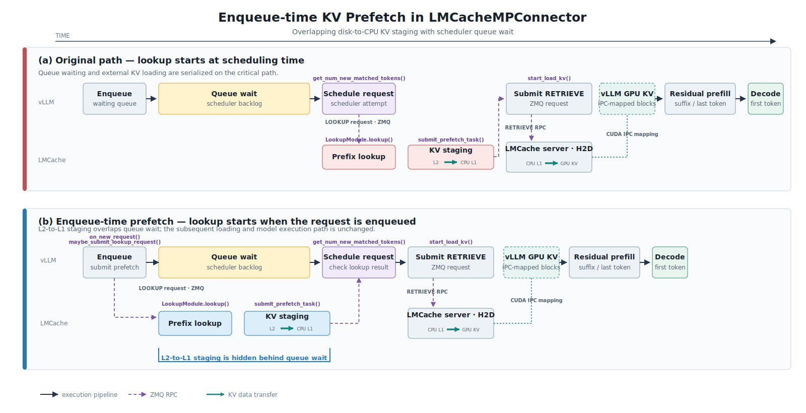

# vLLM 与 LMCache 的 KV Cache 加载链路

> 相关变更：[Enqueue-time KV prefetch](https://github.com/vllm-project/vllm/pull/42321)  
> 分析范围：`LMCacheMPConnector` 中的 KV lookup、结果检查与异步加载流程

`LMCacheMPConnector` 负责衔接 vLLM 与独立运行的 LMCache server。第一眼看上去，这件事
似乎就是“把磁盘里的 KV 搬到显存”，但代码里的实际链路要长一些：scheduler-side 先查
命中，LMCache 再做分层缓存预取，worker-side 提交加载，最后还要通过 CUDA IPC 跨进程
访问显存。

这次优化抓住的其实是请求被调度之前的空档：请求既然已经在 waiting queue 里排队，
就没必要等它真正被选中后再查 KV。把 lookup 提前，LMCache 的 `L2 → CPU L1` staging
就能和 scheduler queue wait 并行，一部分存储 I/O 延迟也就被藏进了排队时间里。



*图 1：入队时 KV 预取前后的加载路径。原始流程在 scheduler 选中请求后才提交 lookup，
因此排队等待与外部 KV Cache 查询串行执行；优化后的流程通过 `on_new_request()` 提前调用
`maybe_submit_lookup_request()`，使磁盘到 CPU memory 的 staging 与排队过程重叠。请求真正
被调度后，两条路径都会通过 `start_load_kv()` 提交 `RETRIEVE`，再由 LMCache server 将
CPU memory 中的 KV 搬运到 vLLM 的 GPU KV blocks。CUDA IPC 使 LMCache server 能够访问
vLLM 进程预先注册的显存区域。*

这里有个很容易混淆的地方：图中的线并不都是“KV 数据传输”。vLLM 与 LMCache 之间的
lookup、状态检查和 retrieve 是 ZMQ message queue 上的控制流；LMCache 内部的
`L2 → CPU L1` 才是 storage backend I/O，具体怎么传取决于本地磁盘或远端存储后端。
CPU 到 GPU 的 H2D 搬运由 LMCache 侧执行，目标则是通过 CUDA IPC 映射的 vLLM GPU KV
blocks。

## 核心函数及其分工

这四个函数可以按执行阶段分成两组。前三个在 scheduler-side，负责查外部
KV Cache 的连续 prefix 命中，并据此完成 GPU block 分配；`start_load_kv()` 在
worker-side，负责在 model forward 前提交异步 retrieve。真正搬数据的是 LMCache。

| 函数 | 执行侧 | 主要作用 | 返回值 |
|---|---|---|---|
| `get_num_new_matched_tokens()` | vLLM scheduler | 调度请求时计算除本地命中外还可从 LMCache 加载的 token 数 | `(int \| None, bool)` |
| `maybe_submit_lookup_request()` | vLLM scheduler adapter | 在尚未提交 lookup 时，通过 ZMQ 向 LMCache 发起 prefix 查询 | `None` |
| `check_lookup_result()` | vLLM scheduler adapter | 非阻塞检查 lookup future，并将连续命中的 chunk 数换算为 token 数 | `int \| None` |
| `start_load_kv()` | vLLM worker | 在 forward 前批量提交异步 `RETRIEVE`，并通过 CUDA IPC event 建立执行顺序 | `None` |

更详细的接口与返回值分析参见
[`lmcache-kv-function-details.md`](./lmcache-kv-function-details.md)。

### Scheduler-side：查询可复用的 KV Cache

请求排进 waiting queue 之后，scheduler 每次尝试调度它时，都会走到
`get_num_new_matched_tokens()`。这个函数主要回答两个问题：LMCache 在 vLLM 本地已有 KV
之外还能提供多少连续 prefix token，以及后续加载是不是异步的。

函数内部会依次调用 `maybe_submit_lookup_request()` 和 `check_lookup_result()`：

```text
get_num_new_matched_tokens()
    ├─ maybe_submit_lookup_request()  提交或复用已有 lookup
    └─ check_lookup_result()          非阻塞读取 lookup 结果
```

这里依赖了 `maybe_submit_lookup_request()` 的幂等性：如果同一个 `request_id` 已经有
lookup future，重复调用就直接返回，不会再向 LMCache 发一遍请求。有了这个前提，新的
流程可以放心地在 `on_new_request()` 中提前提交 lookup，同时保留调度阶段的原调用兜底。

`check_lookup_result()` 不会阻塞 scheduler。lookup 尚未完成时返回 `None`，scheduler
跳过该请求并在后续调度轮次重新检查；返回 `0` 表示外部缓存没有可用的连续 prefix；返回
正整数则表示 LMCache 命中的 token 总数。`get_num_new_matched_tokens()` 还会扣除 vLLM
本地已经拥有的 KV，最终得到实际需要从外部加载的 token 数量。

### Worker-side：将 KV Cache 加载到 GPU

命中长度确定后，scheduler 会为待加载 KV 分配目标 GPU blocks，并通过 connector metadata
将 request ID、加载操作和 block 映射传递给 worker。vLLM worker 随后在 model forward 前
调用 `start_load_kv()`，批量提交异步 `RETRIEVE` 请求。

名字叫 `start_load_kv()`，但它并不亲自做 CPU 到 GPU 的内存拷贝。它会在当前 CUDA
stream 上记录一个可跨进程使用的 CUDA event，然后把 retrieve 操作提交给 LMCache。
LMCache server 等待该 event 满足后，通过已经建立的 CUDA IPC 映射访问 vLLM 的 paged
KV blocks，并执行 H2D 搬运。简单说，IPC 映射解决“写到哪里”，CUDA event 解决“什么时候
可以写”。

## 完整调用链

整体流程可以概括为：

```text
请求进入 waiting queue
        │
        │ 提前提交 lookup
        ▼
maybe_submit_lookup_request()
        │
        │ scheduler 尝试调度请求
        ▼
get_num_new_matched_tokens()
        │
        ├─ maybe_submit_lookup_request()  # 未提交时兜底
        └─ check_lookup_result()          # 非阻塞检查结果
                │
                ├─ None      → 本轮暂不调度，后续再次检查
                ├─ 0         → 外部缓存未命中，执行常规 prefill
                └─ N tokens  → 分配 GPU blocks，准备异步加载
                                      │
                                      ▼
                           update_state_after_alloc()
                                      │
                                      ▼
                           build_connector_meta()
                                      │
                                      ▼
                               start_load_kv()
                                      │
                                      ▼
                       LMCache server 执行 H2D 搬运
```

这里再强调一次，lookup/prefetch 和 load/retrieve 不是同一个阶段。前者查询连续 prefix
命中，并把 KV 从 L2 storage 提前读入 CPU memory；后者必须等 scheduler 确定命中长度、
分配好目标 GPU blocks 后才能开始。所以这次优化提前的是 lookup 和
`L2 → CPU memory` staging，不是 `start_load_kv()`。

## 入队时预取带来的变化

修改前后的核心差异可以压缩为两条时间线：

```text
修改前：enqueue → queue wait → get_num_new_matched_tokens → submit lookup → check
修改后：enqueue → submit lookup → queue wait → get_num_new_matched_tokens → check
```

改动本身并没有重写加载链路。`get_num_new_matched_tokens()`、
`check_lookup_result()`、GPU block allocation 和 `start_load_kv()` 还是做原来的事，只是
首次 lookup 从调度阶段挪到了请求入队阶段。原有状态机也保留着，再利用
`maybe_submit_lookup_request()` 的幂等性避免重复 lookup。

换句话说，这个优化没有让磁盘更快，也没有改变 H2D 数据通路；它只是让 I/O 更早开始，
尽量别让 GPU 在请求排完队之后继续等数据。
